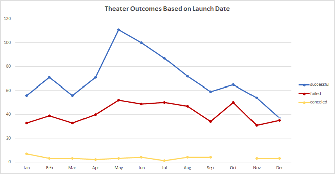

# Kickstarting with Excel
## Overview of Project
This project investigates the factors indicating a successful crowdfunding project mainly in the theater campaign to help Louise have a better understanding of the campaign data and see if she can meet her play Fever’s budget goal, which is above $10,000.00. Our dataset includes campaigns that are available between 2009 and 2017. The results indicate that Louise may need to lower her budget target and launch her play in May to increase her probability of success.
### Purpose
The main purpose of this project is to help Louise know how different theater campaigns performed in relation to their launch days and the funding targets.We also try to find the factors which help Louise meet her campaign goal.

## Analysis and Challenges
### Analysis of Outcomes Based on Launch Date
There are 1369 theater campaigns in total, 839 campaigns are successful, and 493 campaigns are failed. Chart Theater Outcomes Based on Launch Date presents the trend of theater outcomes based on Launch Date. It indicates that both the successful and failed campaigns follow the similar trend and distribution. The peak of launching the most successful theater campaigns is May. 

Chart Theater Outcomes Based on Launch Date

### Analysis of Outcomes Based on Goals
All campaigns in category Plays are completed. For the Goals [less than 1000, 29999], the percentage of successful plays decreases when the goal is increasing. For the Goals [10000, 14999], which is the closest range to Louise’s budget target, the percentage of successful campaigns is higher than the failed projects. But the difference between the successful and the failed is quite small comparing with the difference with goals less than 5000. This indicates that Louise’s funding target might be high. Lower the budget goal helps to increase the probability of success.

Chart Outcomes Based on Goals

### Challenges and Difficulties Encountered
One potential difficulty is to take the campaign completion duration into consideration. The crowdfunding goal is accumulated so the longer the showtime, the closer the target budget. However, the cost will also go up when the show continues. One potential prospect is to specify the duration of campaign.

Separating Plays by their classification may also give Louise a better understanding of the determinants of a successful play.

## Results
The results shed light on the factors of a successful crowdfunding project in the theater campaign. The chart shows that there is a similar trend and distribution between the successful and failed campaigns. May is the best month to launch the theater campaign and make it successful.  Also, our analysis indicates that Louise’s funding target might be high since the percentage of successful projects decreases when the budget goal is increasing.

The potential future prospect is to specify different play types and test their effect on the campaign outcomes. Separating theaters’ projects based on their showtime lasting period may also give us a better understanding of the suitable campaign duration which helps indicate a successful crowdfunding project. The chart of Theater Outcomes Based on Launch Date may be improved by adding Country to its filter.
